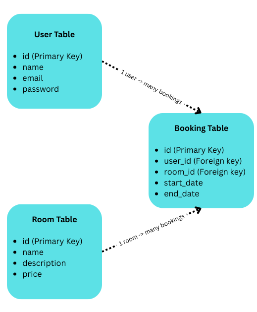

# Flash Hotel – paperless bookings, finally

## Table of Contents
- [TestPlan](docs/TestPlan.md)

## Project Purpose

Flash Hotel is a paperless room booking system built using Flask. It demonstrates how small accommodation providers can manage customer bookings without relying on paper-based systems. This project was created for the Level 5 Diploma in Web Application Development, under Project 3: Back-End Development.

## Features

- Secure user registration and login with hashed passwords (bcrypt)
- Booking system that prevents overlapping bookings
- View, edit, and delete personal bookings
- Date validation for check-in and check-out
- Flash messaging for user feedback
- Auth-protected routes
- GitHub-integrated webhook for automatic deployment

## Technology Stack

- **Backend Framework**: Flask
- **Database**: SQLite
- **ORM**: SQLAlchemy
- **Form Handling**: WTForms
- **Templating Engine**: Jinja2
- **Styling**: Bootstrap 5
- **Deployment**: PythonAnywhere
- **Version Control**: Git and GitHub

## Data Model

The application uses a simple relational structure with the following tables:

- `User` ...registered users who can book rooms
- `Room` ...predefined rooms available for booking
- `Booking` ...links users to rooms with selected dates

A visual diagram of the schema is shown below:



## Setup Instructions

To run the app locally:

1. Clone the repository:

   ```bash
   git clone https://github.com/dailafing/FlaskHotel.git
   cd FlaskHotel
   ```

2. Create a virtual environment:

   ```bash
   python3 -m venv venv

   source venv/bin/activate   # on Linux/macOS

   # OR
   
   venv\Scripts\activate      # on Windows
   ```

3. Install the required packages:

   ```bash
   pip install -r requirements.txt
   ```

4. Start the development server:

   ```bash
   flask run
   ```

5. Open your browser and visit:

   ```
   http://127.0.0.1:5000/
   ```

## Deployment (PythonAnywhere)

The site is live at:

[https://dailafing.pythonanywhere.com/](https://dailafing.pythonanywhere.com/)

Deployment is handled using a GitHub webhook. On push, the server pulls the latest code and touches the WSGI file to reload the app. Secrets (like `SECRET_KEY`) are stored in an environment file on the server.

## Testing Evidence

Manual test cases, including screenshots, are available in:

→ [TestPlan](docs/TestPlan.md)

Each test documents the expected behaviour for key user actions and system responses.

## Accessibility

- Semantic HTML used throughout (e.g. `<main>`, `<nav>`, `<section>`)
- Colour contrast checked for compliance

## Security

- Passwords are hashed using bcrypt before storing
- CSRF protection is enabled on all forms
- Sensitive keys (e.g. `SECRET_KEY`) are not committed to repo

## Version Control

- Git used for version control
- Clear commit history maintained on GitHub
- `.gitignore` excludes sensitive files (DB, venv, cache)

## Credits

- [Flask Documentation](https://flask.palletsprojects.com/)
- [Bootstrap Framework](https://getbootstrap.com/)
- [PythonAnywhere](https://www.pythonanywhere.com/)
- [WTForms](https://wtforms.readthedocs.io/)
- [GitHub](https://github.com/)
